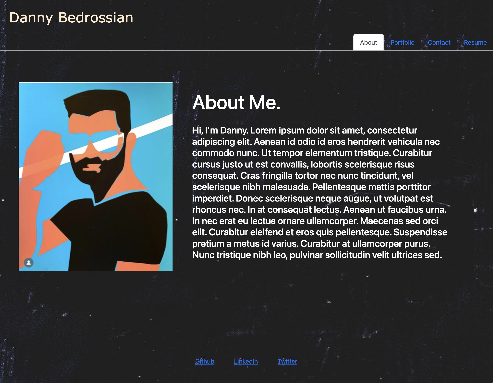

# React Portfolio

This is my portfolio, made with React!

## Table of Contents

- [Background](#background)
- [Install](#install)
- [Usage](#usage)
- [Screenshot](#screenshot)
- [Maintainers](#maintainers)
- [Contributing](#contributing)
- [Contributors](#contributors)
- [License](#license)

## Background

*To learn how React works and to get practice in it,* we were instructed to make a portfolio page using React. It includes multiple tabs, loads as a single application, and links to many projects I've worked on over the semester.

## Install/Link to Webpage 🔗 

Here's a link to the deployed application:

https://dbedrossian.github.io/Mod20_React-Portfolio/

And here's the repo link!:

https://github.com/dbedrossian/Mod20_React-Portfolio

## Usage

It'll be useful as a portfolio website once it's polished, so for now this is being used as an assignment project.

## Screenshot

## Maintainers

[@Danny Bedrossian](https://github.com/dbedrossian).

## Contributing

Feel free to dive in! [Open an issue](https://github.com/dbedrossian/standard-readme/issues/new) or submit PRs.

## Contributors

Work on this alone.

## License

© Danny Bedrossian